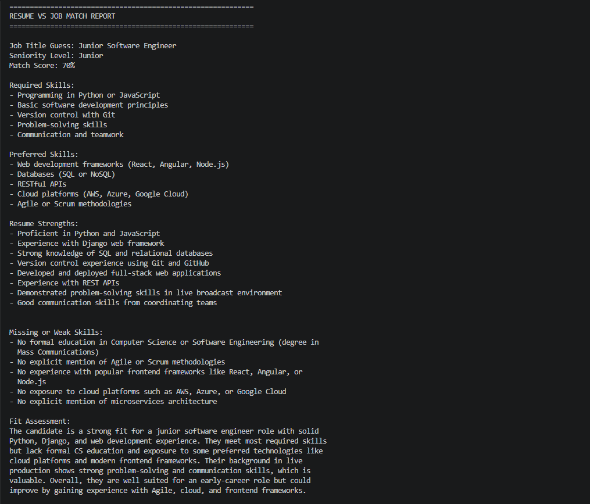
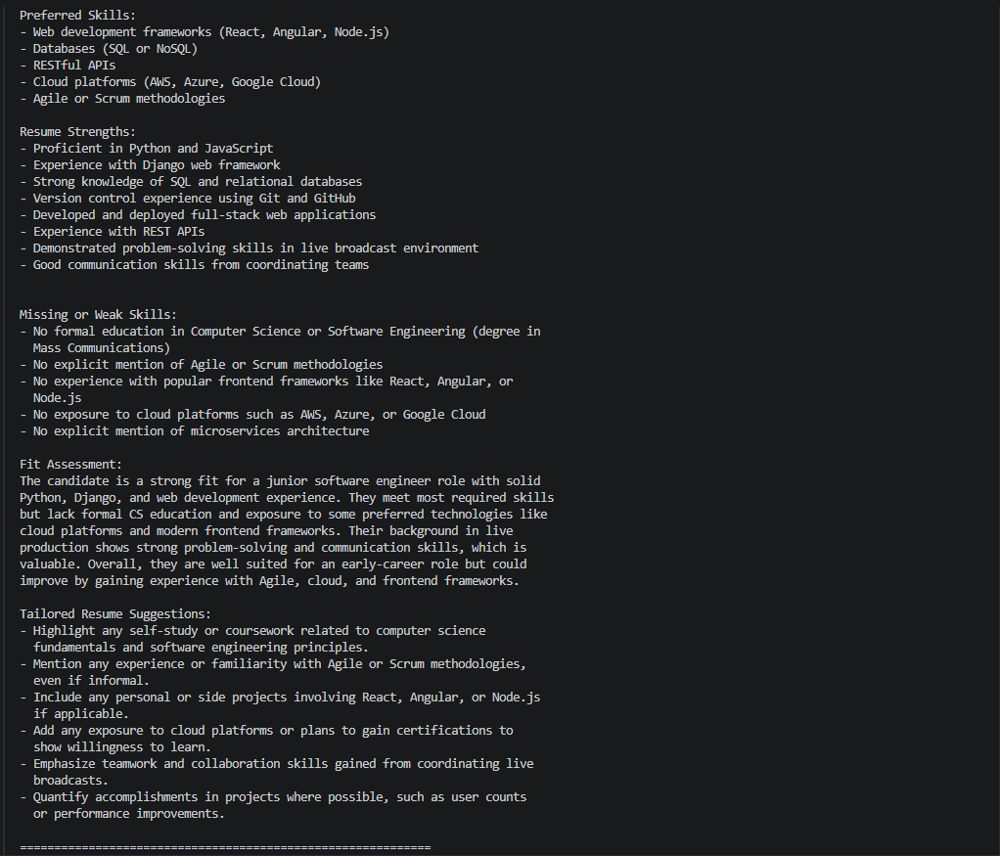

# AI Job Description Analyzer

An AI-powered Python CLI tool that analyzes job descriptions and compares them against resume content to generate match scores, identify skill gaps, and produce tailored resume recommendations using LLM APIs.

## Why I Built This

I built this project to solve a real job search problem: quickly understanding whether a resume aligns with a role and what should be improved before applying. The tool helps turn unstructured job descriptions and resume text into actionable, structured insights.

## Version History

### v1 - Job Description Analyzer
- Extracted likely job title, seniority, required skills, and responsibilities
- Generated fit assessment and resume suggestions
- Saved structured analysis to JSON

### v2 - Resume vs Job Matcher
- Compares resume text against a job description
- Generates a match score from 0 to 100
- Identifies strengths and missing skills
- Produces tailored resume improvement suggestions
- Displays a formatted terminal report

## Tech Stack
- Python
- OpenAI API
- python-dotenv

## How to Run
1. Create a virtual environment
2. Install dependencies:
   pip install -r requirements.txt
3. Create a `.env` file with:
   OPENAI_API_KEY=your_api_key_here
4. Run:
   python main.py

## Screenshot




## Sample Output

```json
{
  "job_title_guess": "Junior Software Engineer",
  "seniority_level": "Junior",
  "required_skills": [
    "Programming in Python",
    "Version control with Git",
    "Basic software development principles"
  ],
  "match_score": 70,
  "resume_strengths": [
    "Experience with Django web framework",
    "Implemented REST APIs",
    "Experience with SQL databases"
  ],
  "missing_or_weak_skills": [
    "No explicit mention of Agile or Scrum",
    "Limited cloud platform experience"
  ]
}